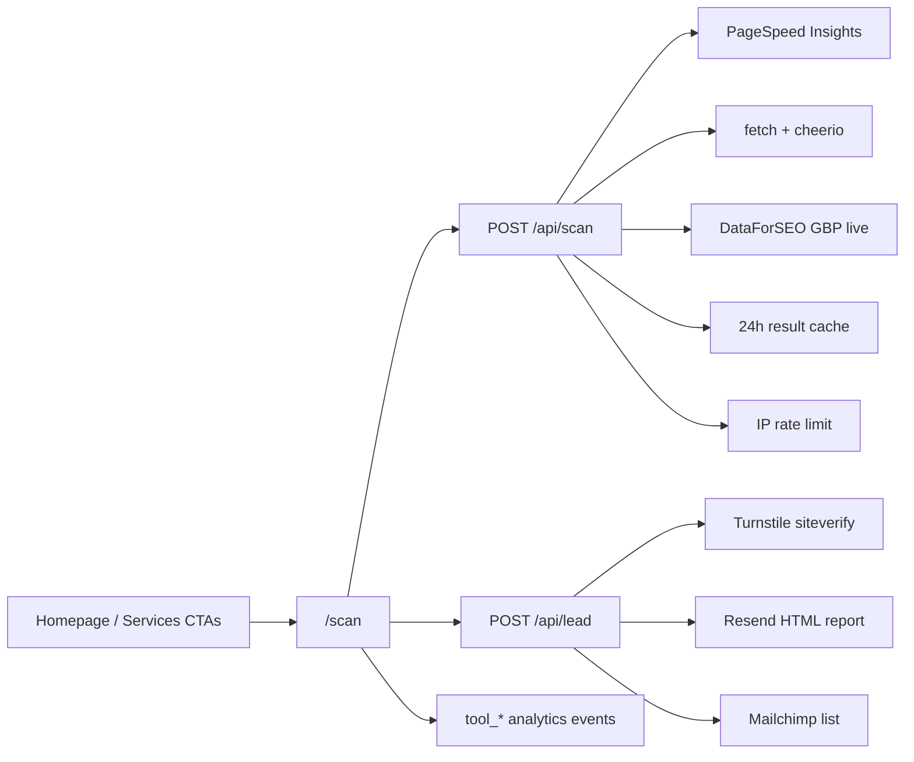

# Digital Footprint Scanner + Site Promotion

## Overview

Ship Nice Right’s flagship free tool: a Digital Footprint Scanner that turns a contractor’s website + business name + city into a visceral “here’s what you’re losing” score, captures email for the full report, and routes warmed leads to a strategy call. Promote the tool from the homepage and services surfaces without reopening commission pricing or building the deferred `/tools` calculators.

Target user: Northwest Chicago / SMB home-services owners who rent growth (ads, lead brokers) and need owned-asset proof in their language (jobs, reviews, findability).

Source of truth for product direction: `docs/lead-gen-tools-plan.md` (approved). This epic is **scanner-first**; Phase 1 calculators are explicitly deferred.

## Goal & Context

- Deliver a self-serve lead magnet with near-zero marginal cost per lead.
- Teach the four levers (Get More Customers, Charge More, Keep Customers, Cut the Waste) via the report structure.
- Prove email-capture motion on the scanner path before investing in `/tools` calculators.
- Keep `fn-1-ac7` (Commission-Based Lead Generation) closed — do not revive its tasks or commission model.

## Architecture & Data Models

Serverful Next.js 14 App Router on Vercel (must leave production static export). No headless Chrome.



- **Cache key (content):** normalized URL + business name + city (GBP depends on name/city).
- **`scanId`:** opaque random token stored with the cache entry — never derived from URL/name/city (enumerable handles would leak report triggers).
- **Shared modules (owned by task .2, implemented by .3 for scan fill):** `getScan(scanId)` / `putScan(...)`, Turnstile verifier, Upstash Redis client + rate-limit helpers.
- **Rate limit:** shared Redis sliding window; cache hits on `/api/scan` do not consume the expensive-path budget; 429 responses include `Retry-After` from limiter reset.
- **SSRF model:** http(s) scheme allowlist + private/link-local/metadata/IPv6 unique-local/loopback denylist (not a domain allowlist — arbitrary contractor sites). Validate the **dialed** IP at connection time (pin lookup; re-check every redirect hop, max 3). Reject non-canonical IP literals.

## API Contracts

### `POST /api/scan`
- **Input:** website URL, business name, city, Turnstile token.
- **Success:** footprint score (0–100 snapshot), 2–3 headline findings, opaque random `scanId`, partial-provider flags when an upstream fails.
- **Errors:** invalid/blocked URL (400); SSRF/private-range deny (400); Turnstile fail (403); rate limit (429 + Retry-After); upstream timeout / hard failure when no usable partial result (502/504) with safe user copy.
- **Side effects:** cache write on successful or intentional partial result; body size + per-provider timeout caps; provider timeouts yield labeled partial when any signal survived.
- **Scoring:** missing provider signals renormalize remaining weights and set `partial` — never zero-fill absent data as failed performance.

### `POST /api/lead`
- **Input:** email, Turnstile token, `scanId`, optional marketing consent flag (unchecked by default).
- **Success:** report emailed via Resend; subscriber added to Mailchimp when consent given.
- **Idempotency:** atomic claim (`SET NX` or equivalent) on `(email, scanId)` **before** Resend, with pending/sent state and TTL ≥ 24h; pass Resend `idempotencyKey` when available. Concurrent duplicates must not double-send.
- **Errors:** invalid email (400); Turnstile fail (403); rate limit (429); missing/expired scan (404/410); Resend failure (502) with clear retry copy; Mailchimp failure must not block report delivery when Resend succeeded.

## Approach

1. Leave `output: 'export'`, clear stale static `outputDirectory` if it would serve `out/`/`dist` without functions, keep `images.unoptimized: true` for this cutover (avoid image-pipeline churn), add `/api/health`, prove reachability on a preview deploy, green existing Playwright on that preview, scaffold env/CSP.
2. Author shared lead + scan-cache **contracts** and `/api/lead` (Turnstile helper, Upstash client/ratelimit, `getScan`/`putScan` interface, Resend + Mailchimp). Scan fill comes in step 3.
3. Implement `/api/scan` against the pre-existing cache interface: PSI (all four categories), cheerio, DataForSEO live, deep SSRF, timeouts under `maxDuration`, scoring with renormalize-on-missing.
4. Build `/scan` UI with per-attempt Turnstile reset, free score, email gate, a11y.
5. Promote `/scan` + analytics (no raw URL/name in GA params) + docs/`llms.txt`/sitemap eligibility.

## Edge Cases & Constraints

- PSI often 10–60s — UI waiting/timeout copy; set route `maxDuration` with per-provider budgets (e.g. PSI 45s, DataForSEO 20s, HTML 10s) that fit the plan limit; if Hobby wall time is structurally insufficient, upgrade to Pro (parked risk).
- Cheerio sees initial HTML only — no full-browser-audit claims.
- Missing CrUX / empty or multi-match GBP → labeled findings; renormalize score weights.
- Secrets never `NEXT_PUBLIC_*` except Turnstile site key.
- Vercel Hobby fair-use/commercial risk: document; prefer Pro if enforcement or wall-clock forces it.
- File-level overlap with open homepage/SEO specs — coordinate; **no hard Flow dep** on unfinished `fn-15`.

## Quick commands

```bash
npm run dev
npm test
npm run lint
npm run build
# Preview proof (task .1): curl -sf "$PREVIEW_URL/api/health"
npx playwright test
```

## Boundaries / non-goals

- Phase 1 `/tools` calculators and `tool_calculator_use` (explicitly deferred — follow-up epic).
- Phase 3: review-gap v2, automated welcome sequence, promotion from GitHub #26 landing pages.
- Reopening `fn-1-ac7` commission / performance-partnership pricing or its superseded calculator paths.
- Headless Chrome / Puppeteer / Playwright as a scan engine.
- Building first-party list infrastructure (Mailchimp only).
- City/industry pSEO page batches (`docs/pseo-opportunity-framework.md` stays the gate).
- Systems-page (`/systems/*`) scanner CTAs (homepage / services / nav / footer only for v1).
- PDF report generation (HTML email for v1).
- Domain allowlisting of scan targets (impossible for arbitrary contractors — use scheme + IP denylist).

## Decision Context

- **Scanner-first over calculators-first:** user chose to defer Phase 1; still ship the shared email pipeline the scanner needs.
- **Leave static export:** same-app Route Handlers; R1 proof is preview `/api/health` + Playwright, not merely `next build`.
- **Keep `images.unoptimized: true` through cutover:** was required for static export; changing image pipeline is out of scope for this epic.
- **Mailchimp:** chosen for v1 list storage (free 500).
- **Turnstile on both scan and email submits:** per approved plan; widget reset/re-execute per attempt (single-use tokens).
- **Captcha UX (locked 2026-08-21):** Cloudflare Turnstile on `/api/scan` and `/api/lead` POSTs only. Do **not** hide the email field behind a pre-reveal captcha. Score stays free on-screen; email gate is where bots are stopped. Protection stack = Turnstile + IP rate limits + SSRF URL guards + opaque `scanId` (not a hashed URL). Marketing list consent stays unchecked-by-default.
- **Task .2 owns shared lib contracts; .3 implements scan fill:** avoids interface drift without reordering the parallel wave after .1.
- **HTML email report; opaque random `scanId`; atomic lead idempotency before Resend.**
- **Upstash Redis** for cache, rate limit, and idempotency keys.
- **No hard dep on fn-15.**
- Rejected: external Worker-only API host; gating on-screen score behind email.

## Acceptance Criteria

- **R1:** Production/preview deploy runs without static `output: 'export'`, serves a trivial `/api/health` with HTTP 200, and the existing Playwright suite stays green on that preview. Errors: static/`outputDirectory` misconfig that omits functions → fail task .1 before any scan/lead work.
- **R2:** `POST /api/scan` accepts URL + business name + city + Turnstile token and returns a snapshot score (0–100) plus 2–3 headline findings, opaque random `scanId`, 24h cache, and per-IP rate limiting with `Retry-After` (cache hits skip expensive-path quota). SSRF uses scheme allowlist + private/IPv6/metadata denylist with connection-time IP pinning and ≤3 re-validated redirects. Errors: invalid/blocked URL → 400; SSRF deny → 400; Turnstile → 403; rate limit → 429 + Retry-After; total upstream failure → 5xx; partial upstream → labeled partial; missing provider signals renormalize weights (never zero-fill as failure).
- **R3:** `/scan` shows free score + headlines without email; loading/timeout UX; accessible labels/errors/`aria-live`; Turnstile widget reset on each submit/retry. Errors: client validation; surfaces R2 errors without hydration mismatch.
- **R4:** Email gate → Turnstile → `POST /api/lead` → Resend HTML report (four levers + strategy-call CTA) + consent-gated Mailchimp; report still sends if list API fails; atomic idempotency before Resend (concurrent-safe). Errors: invalid email → 400; Turnstile → 403; rate limit → 429; missing/expired scan → 404/410; Resend fail → 502 + retry.
- **R5:** Analytics helpers and `docs/analytics-event-map.md` include `tool_scan_submit`, `tool_email_capture`, `tool_report_cta_click` (not `tool_calculator_use`); events fire on UI actions; **no raw URL, business name, email, or other PII in event params** (domain-only or none for scan context). Errors: no error surface beyond missing gtag in dev.
- **R6:** Homepage Nav, Hero (secondary), Services, and Footer promote `/scan` without removing the primary strategy-call/`#contact` path. Errors: ordinary link regression covered by Playwright.
- **R7:** Docs updated: `.env.example`, README env + structure, `public/llms.txt` lists `/scan`, lead-gen plan phases reflect scanner-first + deferred calculators + Mailchimp; `/scan` is sitemap-eligible (not excluded in `next-sitemap.config.js`). Errors: none beyond review completeness.

## Early proof point

Task 1 validates the core approach (preview deploy answers `/api/health` and existing Playwright stays green after leaving static export). If it fails, re-evaluate hosting (external API host vs Vercel serverful / Pro) before building scan/lead features.

## Requirement coverage

| Req | Description | Task(s) | Gap justification |
|-----|-------------|---------|-------------------|
| R1  | Serverful deploy proven via /api/health + Playwright | .1 | — |
| R2  | `/api/scan` score + cache + RL + SSRF | .3 | — |
| R3  | `/scan` free score UI + a11y/loading | .4 | — |
| R4  | Email gate + Resend + Mailchimp + Turnstile | .2, .4 | — |
| R5  | tool_* analytics + event map (no PII params) | .5 | — |
| R6  | Homepage/services/nav/footer promo | .5 | — |
| R7  | README / .env.example / llms.txt / plan / sitemap | .1, .5 | — |
| —   | Phase 1 `/tools` calculators | — | Explicitly deferred (user decision) |
| —   | Phase 3 nurture / #26 promotion | — | Out of scope per approved plan |

## Parked unknowns

- Exact scoring weight numbers — draft in scan-API task; human reviews against ~5 real contractor sites before launch.
- Vercel Hobby commercial fair-use and/or insufficient `maxDuration` — monitor; move to Pro if required.

## References

- `docs/lead-gen-tools-plan.md` — approved product/architecture
- `docs/analytics-event-map.md` — event catalogue to extend
- `docs/pseo-opportunity-framework.md` — do not invent page batches
- GitHub issue #26 — related pilot; not this epic’s build target
- PSI v5: https://developers.google.com/speed/docs/insights/v5/get-started
- Turnstile siteverify: https://developers.cloudflare.com/turnstile/get-started/server-side-validation/
- Resend Node: https://resend.com/docs/send-with-nodejs
- DataForSEO My Business Info live: https://docs.dataforseo.com/v3/business_data/google/my_business_info/live/
- Upstash ratelimit: https://upstash.com/docs/redis/sdks/ratelimit-ts/overview
