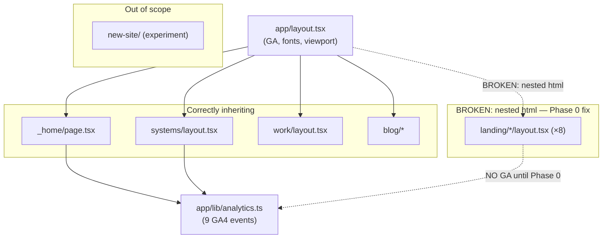

# Full-Scale Site Audit: Perf · SEO · Security · CRO · A11y

## Overview

Comprehensive audit and remediation for the Nice Right Next.js 14 static-export marketing site. Primary goal is qualified lead generation — every fix should be evaluated against whether it moves that needle. The site serves a one-person digital agency targeting Chicago small businesses.

**Critical discovery**: 8 of 10 landing page layouts (`competitor-funeral`, `contractor-growth`, `fillthechair`, `invisible-coo`, `owner-optional`, `skin-in-game`, `tableturn-direct`, `workweek-system`) define their own `<html>/<body>` tags nested inside the root layout, producing invalid HTML, breaking GA on those pages. `customer-surge` and `exit-ready` are already correct. This is a Phase 0 blocker.

## Resolved Decisions

| Question | Decision |
|----------|----------|
| Which design system is canonical? | **V9 dark** (the live homepage at `/`) is canonical. `app/new-site/` is an experiment — out of scope. |
| Landing pages in scope for Lighthouse? | Stub landing pages should be **noindexed** (hidden from search). Structural HTML fix still in scope. |
| GDPR consent banner | **Deferred** |
| `reactStrictMode: false` | **Leave as-is** — intentional; prevents GSAP double-registration in dev mode. |
| Root PNG cleanup | **gitignore + delete working tree files** only. No git history rewrite. |

## Scope

**In scope:**
- Homepage (`/`) — primary conversion funnel
- Systems pages (`/systems/get-running`, `/systems/get-growing`, `/systems/growth-os`) — active offer pages, stay indexed
- All 8 affected landing pages under `/landing/` — structural fix + noindex (hidden from search, accessible via direct link)
- Blog, work, notes — structural fixes only
- Core infrastructure: `vercel.json`, `next.config.js`, `app/layout.tsx`

**Out of scope:**
- `app/new-site/` — design experiment, do not touch
- GDPR consent banner — deferred
- Content rewrites for stub landing pages
- A/B testing framework
- Git history rewrite for root PNGs

## Phases

### Phase 0 — Blocker (must land before anything is measured)
Fix nested `<html>` structure in 8 landing page layouts. Adds noindex to all `/landing/*` pages.

### Phase 1 — Measurement & Security Infrastructure (parallel, no visual changes)
- Security headers in `vercel.json` (zero conflict, 1 file)
- SEO foundations: next-sitemap, canonical URLs, OG metadata, noindex for /landing/
- JSON-LD schema markup: LocalBusiness, FAQPage, WebSite

### Phase 2 — Performance & Structural Fixes (parallel, low conflict)
- Image optimization via Vercel CDN config + explicit dimensions for CLS
- GSAP shared init module + iOS Safari scroll fixes
- Cal.com embed dedup + lazy load + wire missing BookingSection tracking
- Structural pages: not-found, loading, fix error.tsx security leak

### Phase 3 — Quality & Analytics (coordinate with open epics)
- Accessibility: ARIA sweep (Pricing, Services, Proof, Footer, Nav focus trap) + axe tests
- Analytics integrity: validate all events across all routes (depends on Phase 0 + Task 7)

### Phase 4 — Cleanup (independent, low risk)
- Remove 171 root PNGs (gitignore + delete) + 12 prototype HTML files from /public
- Deduplicate 6 identical blog page.css files
- Add E2E tests for critical conversion path

## Architecture Diagram



## Non-Functional Targets

| Metric | Target |
|--------|--------|
| LCP | < 2.5s (mobile, 4G) |
| INP | < 200ms |
| CLS | < 0.1 |
| Lighthouse Performance | ≥ 85 (mobile) |
| Lighthouse Accessibility | ≥ 95 |
| Lighthouse SEO | 100 |
| securityheaders.com grade | A |

## Quick Commands

```bash
# Build and run postbuild (sitemap)
npm run build

# Run unit tests
npm test

# Run E2E (requires dev server)
npm run test:e2e

# Lighthouse on built output
npx lhci collect --staticDistDir=./dist && npx lhci assert --preset=lighthouse:recommended

# Check security headers after deploy
curl -I https://niceright.co | grep -i 'x-content\|x-frame\|csp\|hsts'
```

## Alternatives Considered

- **Vercel CDN image optimization vs next-export-optimize-images**: Chosen Vercel CDN (vercel.json config) — no extra package, same format conversion result.
- **Hash-based CSP vs domain-allowlist**: Hash-based impossible with static export (no per-request nonce). Domain-allowlist with `'unsafe-inline'` accepted tradeoff.
- **app/sitemap.ts vs next-sitemap**: next-sitemap chosen — native sitemap.ts has known issues with output:'export' in Next.js 14.
- **Git history rewrite for PNGs**: Rejected in favor of gitignore-only — lower risk, no coordination needed.

## Risks & Mitigations

| Risk | Mitigation |
|------|-----------|
| Fixing landing page layouts breaks their styles | Test each individually after removing html wrappers; CSS imports work without explicit head tags |
| CSP blocks GA4 or Cal.com embed | Test deployed headers before shipping; Cal.com domains in frame-src |
| GSAP iOS fix breaks other scroll behavior | Apply normalizeScroll only for touch devices; test on real iPhone |
| a11y task conflicts with fn-2-gfq | Task 9 touches Pricing, Services, Proof, Footer, Nav — fn-2-gfq covers Hero, ServicesCarousel, Testimonials, FAQ |
| suppressHydrationWarning masking real bug | Do NOT remove — flag as known tech debt outside this epic scope |
| reactStrictMode: false | Leave as-is (intentional GSAP workaround) |

## Rollout

Static-export site. Rollback = Vercel instant rollback. No database or API changes.

## Docs to Update After This Epic

- `README.md`: deployment checklist, analytics event list, security headers note
- Create `docs/ANALYTICS.md`: event taxonomy, GA4 ID, validation steps
- Create `docs/SEO-AND-METADATA.md`: schema types, sitemap config, canonical strategy

## Acceptance

- [ ] HTML validator finds zero nested `<html>` elements on all routes
- [ ] GA4 fires on all 8 fixed landing pages (GA4 Realtime report)
- [ ] All `/landing/*` pages have `<meta name="robots" content="noindex">`
- [ ] securityheaders.com rates niceright.co at grade A
- [ ] Google Rich Results Test passes for LocalBusiness schema
- [ ] sitemap.xml and robots.txt present in production
- [ ] Lighthouse performance ≥ 85 on mobile homepage
- [ ] Lighthouse accessibility ≥ 95 on homepage
- [ ] No axe violations on homepage (automated)
- [ ] `trackBookingComplete` fires for bookings on both homepage AND systems pages
